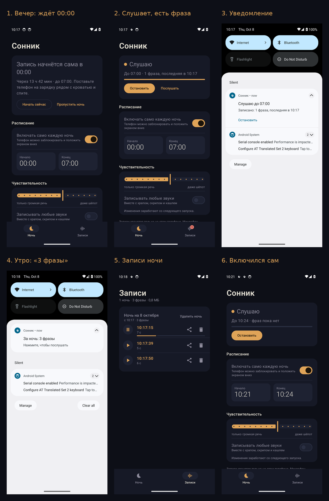
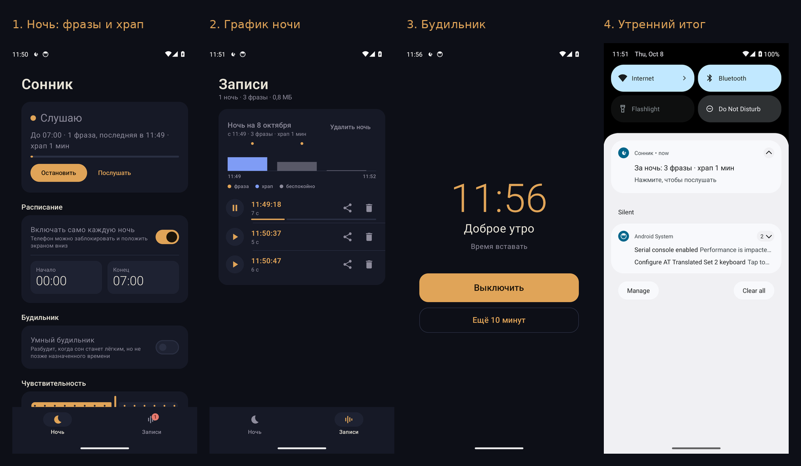
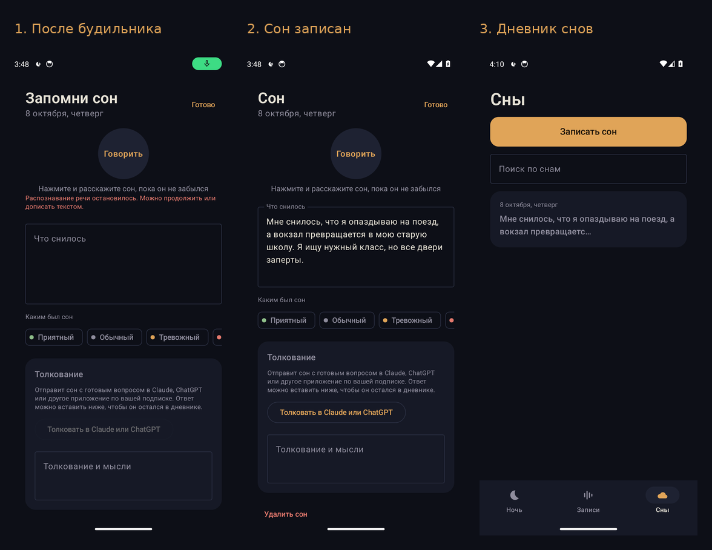

# Sleeptalk — запись разговоров во сне

Программа всю ночь слушает микрофон и сохраняет только те моменты, когда вы говорите.
Утром — папка с короткими клипами, журнал по времени и HTML-страница, где их удобно прослушать.
По желанию клипы расшифровываются в текст (Whisper, работает офлайн).

## Как это работает

1. Первые 3 секунды программа меряет фон комнаты (вентилятор, улица).
2. Фон — это 20-й перцентиль громкости за последние 30 секунд: короткий храп его не поднимает,
   а включённый вентилятор учитывается за полминуты.
   Звук считается кандидатом в речь, если он на 10 dB громче фона **и** больше 45 % его энергии
   лежит в речевом диапазоне 300–3400 Гц. Так отсеиваются храп, гул и одиночные щелчки.
3. Эпизод сохраняется с 2 секундами до начала (чтобы не обрезать первое слово)
   и заканчивается после 2,5 секунды тишины. Совсем короткие звуки (< 0,25 с речи) выбрасываются.

Всё записанное остаётся только на вашем компьютере.

## Приложение для Android (папка `android/`)



Снято автоматически на эмуляторе: вечер, запись, уведомление, утренний итог, список фраз и
самостоятельный запуск при выключенном экране. Видео: [docs/android-demo.mp4](docs/android-demo.mp4).

Основной вариант для телефона. Само включается каждую ночь в заданное время (по умолчанию 00:00–07:00),
работает при заблокированном экране и утром присылает уведомление «За ночь: 3 фразы».

**Установка.** APK собирает GitHub Actions при каждом изменении в `android/`.
Откройте на телефоне страницу Releases репозитория, скачайте `Sonnik.apk` из релиза
«Сонник …» и установите (Android попросит разрешить установку из браузера).
Новые сборки ставятся поверх старой, записи сохраняются.

**Первый запуск.** На вкладке «Ночь» будет список «Чтобы всё работало само»: микрофон,
уведомления, запуск поверх экрана блокировки и работа без ограничений батареи. Разрешите всё.

**Как устроен автозапуск.** Android разрешает включить микрофон только приложению, которое
видно на экране. Поэтому за минуту до начала ночи Сонник на секунду открывается поверх
экрана блокировки (с минимальной яркостью и без звука), включает запись и закрывается.
Дальше он слушает в фоне, держит уведомление «Слушаю до 07:00» и сохраняет только фразы.
Если нажать «Начать сейчас» вечером, микрофон включится сразу, а сохранять Сонник начнёт
с начала ночи, и в полночь экран не загорится.



**Только голос.** Микрофон всегда работает на максимальной чувствительности (звук на 4 дБ громче
тишины комнаты), но сохраняется только речь. Что за звук, решает нейросеть YAMNet от Google
(521 вид звуков, лицензия Apache 2.0) прямо на телефоне, без интернета. Тишина, белый шум, гул
вентилятора и кондиционера отбрасываются. У фразы обрезается шум до и после, а если в одном
длинном отрезке было несколько фраз далеко друг от друга, они сохраняются отдельными записями.
Тихие записи при сохранении усиливаются.

Если включить «Другие звуки тоже», сохраняются и они, по категориям: храп, кашель, скрип и шорох
(мебель, ворочание, шаги, двери, стук), улица (машины, сирены, собаки, птицы, дождь, ветер) и
другое. Храп — один образец раз в 10 минут, прочие звуки — не чаще раза в 2 минуты каждого вида и
не больше 120 за ночь. На экране «Записи» есть фильтр по категориям. Записи можно перематывать и
слушать быстрее: 1,5× и 2×.

**Храп и график ночи.** Каждая минута ночи раскладывается на речь, храп, другие звуки и
«беспокойство» (сколько времени было слышно что-то громче тишины комнаты). Храп отличается от
других низких звуков ритмом: нужно минимум три низких всплеска в минуту, по одному на вдох,
поэтому хлопнувшая дверь храпом не считается. На экране «Записи» у каждой ночи есть график по
минутам и итог «храп 23 мин»; он же приходит утром в уведомлении.

**Умный будильник.** Задаёте «разбудить не позже 07:00» и окно 15/30/45 минут. Пока идёт запись,
Сонник смотрит на последние минуты: если вы заметно беспокойнее обычного для этой ночи
или говорите, значит, сон лёгкий, и будильник звонит раньше; иначе ровно в 07:00. Это грубая
оценка по звуку, а не настоящие фазы сна: по одному микрофону их не измерить. Запасной точный
будильник стоит всегда, так что он прозвонит, даже если запись ночью не шла.
Будильник открывается поверх экрана блокировки. Мелодию будильника играет сам Сонник на
громкости будильника, сначала тихо, потом громче, с вибрацией, так что он звонит, даже если
звуки уведомлений выключены. Звучит, пока его не выключат, умеет «ещё 10 минут»; если его
проспали, через 10 минут звонит снова (до трёх раз). «Выключить» заодно останавливает запись и
сразу открывает запись сна. Пока будильник звонит, кнопка «Выключить» есть и в самом Соннике.



**Дневник снов.** После будильника (или из утреннего уведомления) открывается экран «Запомни сон»:
нажимаете «Говорить» и рассказываете, телефон переводит речь в текст, паузы не страшны. Можно
отметить настроение сна, а под ним видно, что приложение записало той же ночью. Сон сохраняется
сам, пока вы пишете, так что не пропадёт, даже если телефон сменит тему или выгрузит приложение.
«Толковать в Claude или ChatGPT» отправляет сон с готовым вопросом в приложение по вашей подписке;
ответ возвращается в дневник одной кнопкой «Вставить ответ из буфера». На вкладке «Сны» есть
поиск по всем снам.

**Хранение.** Все записи хранятся целиком, пока вы сами их не удалите: приложение ничего не
стирает и не обрезает. Сколько места они занимают, видно вверху экрана «Записи».

**Плитка в шторке.** В быстрых настройках можно добавить плитку «Сонник»: одно касание
включает запись сразу, второе останавливает.

Если вечером передумали, на главном экране есть «Пропустить ночь» (и «Всё-таки записать»).
Если в начале ночи вы пользуетесь телефоном, Android не открывает приложения поверх того, что
на экране, поэтому Сонник пробует снова каждые 10 минут и включает запись, как только экран
погаснет. Если ночью Android закрыл приложение, телефон перезагрузился или Сонник обновился,
запись включится снова. Время будильника и конец ночи можно менять прямо во время записи.

**Журнал.** Внизу вкладки «Ночь» есть «Журнал: что происходило ночью»: когда сработал автозапуск,
включилась ли запись, звонил ли будильник, чего не хватило из разрешений. Им можно поделиться.

**Samsung.** Samsung усыпляет приложения, которые считает ненужными, и они пропускают свои
будильники. На Samsung в Соннике есть подсказка и кнопка: добавьте его в «Приложения, которые
никогда не переходят в спящий режим» (Настройки → Батарея → Ограничения фонового использования).

**Тесты.**
- `CORE_ONLY=1 ./gradlew :core:test` — детектор, расписание, WAV; Android SDK не нужен.
- `./gradlew :app:testDebugUnitTest` — Robolectric: настоящая служба записи с подставным
  микрофоном, хранилище, будильник и автозапуск, экраны на Compose.
- Демо на эмуляторе Android 14 (`demo/run-demo.sh`, запускается в GitHub Actions):
  проходит первый запуск без разрешений так, как это делал бы человек, проигрывает
  синтезированную «ночь» с тремя фразами и храпом вместо микрофона (сохраниться должны три фразы
  и ничего больше), проверяет автозапуск при
  выключенном экране, будильник и запись сна, повторяет экраны с крупным шрифтом и на маленьком
  телефоне и меняет настройку телефона посреди записи сна. Скриншоты, видео и журнал лежат
  в релизе рядом с APK (`Sonnik-demo.zip`). Сценарий падает, если фраз не три, автозапуск или
  будильник не сработали или сон не сохранился.

Сборка локально: `cd android && ./gradlew :app:assembleRelease` (нужен Android SDK).

## Версия для браузера (папка `web/`)

Веб-приложение «Сонник» работает в браузере телефона (Safari на iPhone, Chrome на Android)
и ставится на главный экран как обычное приложение. Детектор тот же, что и в Python-версии.

**Как открыть.** Микрофон в браузере работает только по https, поэтому страницу нужно выложить:
GitHub → Settings → Pages → Source: *Deploy from a branch* → ветка с этим кодом, папка `/ (root)`.
Через минуту приложение будет по адресу `https://<логин>.github.io/<репозиторий>/sleep-talk-recorder/web/`.
Откройте его на телефоне → «Поделиться» → «На экран Домой».

**Как пользоваться ночью.**
1. Поставьте телефон на зарядку у кровати, нажмите «Начать ночь» и разрешите микрофон.
2. Не блокируйте телефон кнопкой: при блокировке браузер выключает микрофон.
   Приложение само держит экран включённым и через 15 секунд делает его почти чёрным.
   Если телефон всё равно гаснет, на эту ночь выключите автоблокировку в настройках.
3. Утром нажмите «Остановить запись» (или запись остановится сама в выбранное время).
   Фразы будут списком со временем; «Сохранить» отправляет WAV в Файлы, Telegram и т. д.

Записи хранятся только в браузере на телефоне. Расшифровать их можно Python-версией:
сохраните WAV-файлы в папку и запустите `python -m sleeptalk transcribe <папка>`.

Проверка детектора: `node --test tests/detector.test.js`.

## Установка

```bash
cd sleep-talk-recorder
python3 -m venv .venv && source .venv/bin/activate
pip install -r requirements.txt
# Linux: sudo apt install libportaudio2
# Для расшифровки в текст: pip install faster-whisper
```

## Использование

```bash
python -m sleeptalk devices                 # какие микрофоны есть
python -m sleeptalk listen                  # слушать до Ctrl+C
python -m sleeptalk listen --until 07:30    # остановиться утром само
python -m sleeptalk listen --until 07:30 --transcribe   # и сразу расшифровать
```

Утром откройте `recordings/<дата_время>/index.html`.

Расшифровать уже записанную ночь или пересобрать страницу:

```bash
python -m sleeptalk transcribe              # последняя ночь
python -m sleeptalk report recordings/2026-10-08_2340
```

### Если пишете ночь на телефон

Запишите всю ночь любым диктофоном, сохраните в WAV (16 бит) и вырежьте эпизоды:

```bash
python -m sleeptalk extract night.wav --start 2026-10-08T23:40
```

## Настройка чувствительности

| Проблема | Что поменять |
|---|---|
| Пропускает тихое бормотание | `--threshold 6` |
| Пишет слишком много лишнего | `--threshold 14`, `--min-speech 1` |
| Хочется писать и храп, и любые звуки | `--any-sound` |
| Одна фраза режется на куски | `--hangover 4` |

Советы: положите ноутбук или микрофон в 1–2 метрах от кровати, отключите в системе
шумоподавление/автоусиление микрофона и не давайте компьютеру уходить в сон.

## Структура

```
sleeptalk/detector.py    детектор речи (адаптивный порог + речевой диапазон)
sleeptalk/storage.py     WAV-клипы и events.csv
sleeptalk/cli.py         команды listen / extract / transcribe / report / devices
sleeptalk/transcribe.py  расшифровка через faster-whisper
sleeptalk/report.py      HTML-страница ночи
tests/                   тесты на синтетическом звуке: python -m pytest
```
